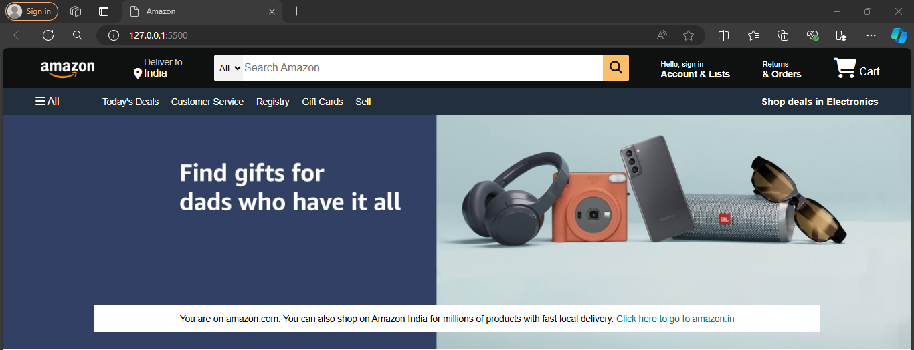
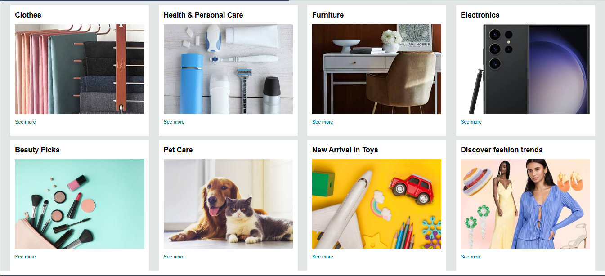
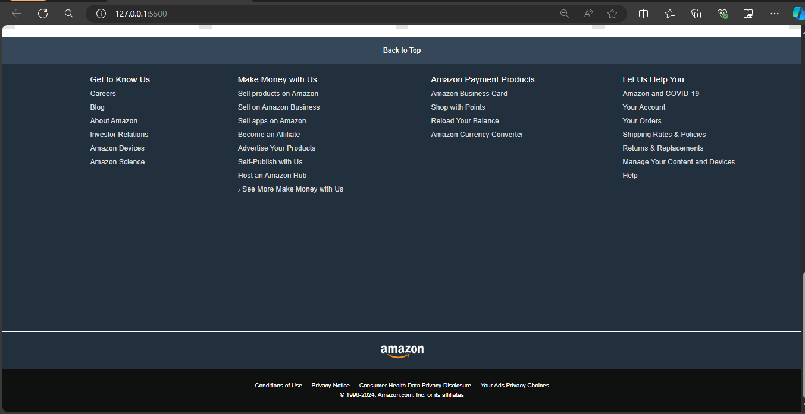

# Amazon Clone

This project is a clone of the Amazon website created using only HTML and CSS. The goal of this project is to practice and demonstrate front-end web development skills, particularly in structuring a webpage with HTML and styling it with CSS.

## Features

- **Home Page**: A replica of Amazon's homepage, including the navigation bar, banner, product listings, and footer.
- **Responsive Design**: The website layout is responsive and adapts to different screen sizes, making it mobile-friendly.
- **Product Categories**: Different sections to display various product categories.
- **Search Bar**: A stylized search bar similar to the one on Amazon.
- **Footer**: Includes links to various pages like Customer Service, Privacy Policy, etc.

## Screenshots

### Screenshot of Homepage



### Screenshot of Section



### Screenshot of Footer



## Getting Started

### Prerequisites

To view this project, you only need a web browser.

### Installation

1. Clone the repository:
    ```bash
    git clone "https://github.com/sahilsawantGEC/Amazon-Clone.git"
    ```
2. Navigate to the project directory:
    ```bash
    cd Amazon-Clone
    ```
3. Open `index.html` in your web browser to view the project.

## Usage

- Navigate through the homepage to explore different product categories.
- Use the search bar to simulate searching for products.
- Scroll to the footer to see additional links and information.

## Project Structure

```plaintext
amazon-clone/
├── index.html
├── css/
│   └── styles.css
└── images/
    └── various-images-used-in-the-project
```

- `index.html`: The main HTML file that structures the content of the Amazon clone.
- `css/styles.css`: The CSS file that contains the styles for the project.
- `images/`: A folder containing images used in the project.

## Contributing

Contributions are welcome! If you'd like to improve this project, please fork the repository and submit a pull request.

## License

This project is open source and available under the [MIT License](LICENSE).

## Contact

For any inquiries, please contact sahilsawant0408@gmail.com.

---


